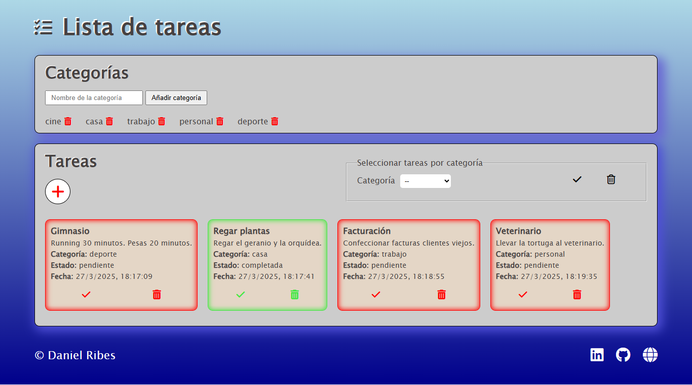

# Lista de Tareas

[]()
[]()
[]()
[]()
[)]()


¡Bienvenido a la Lista de Tareas! Un sencillo pero efectivo gestor de tareas diseñado para ayudarte a organizar tus actividades diarias.

## Descripción :memo:

Este proyecto es una aplicación web que te permite gestionar tus tareas de manera eficiente. Puedes crear diferentes categorías para organizar tus tareas por tipo 
(por ejemplo, "Trabajo", "Personal", "Compras", etc.). Dentro de cada categoría, puedes añadir tareas específicas con sus detalles.

Las principales funcionalidades incluyen:

* **Creación de Categorías:** Organiza tus tareas en grupos temáticos.
* **Creación de Tareas:** Añade nuevas tareas a las categorías existentes.
* **Visualización de Tareas:** Consulta todas tus tareas de forma general.
* **Filtrado por Categoría:** Visualiza únicamente las tareas que pertenecen a una categoría específica.
* **Eliminación de Categorías:** Elimina categorías que ya no necesites.
* **Eliminación de Tareas:** Elimina tareas que ya no necesites recordar.
* **Completar Tareas:** La tarea completada cambiará de color rojo a verde. Puedes volver a marcarla como "incompleta" activando nuevamente el botón.

## Tecnologías Utilizadas :computer:

Este proyecto ha sido desarrollado utilizando las siguientes tecnologías:

* **HTML:** Para la estructura y el contenido de la aplicación.
* **Sass:** Para el estilizado y la apariencia visual, utilizando preprocesamiento CSS.
* **Vite:** Como herramienta de construcción y servidor de desarrollo para una experiencia de desarrollo rápida y eficiente.
* **JavaScript:** Para la lógica y la interactividad de la aplicación.

## Características Principales :page_facing_up:

* Interfaz de usuario intuitiva y fácil de usar.
* Organización clara de tareas por categorías.
* Funcionalidad para añadir y eliminar categorías y tareas.
* Posibilidad de filtrar las tareas por categoría para una visualización más enfocada.

## Vista previa del diseño :clipboard:



*Pantalla principal mostrando la lista de tareas y las categorías.*

## Instalación y Uso 👈

Para ejecutar este proyecto localmente, sigue estos pasos:

1.  **Clona el repositorio:**
    ```bash
    git clone <URL_DE_TU_REPOSITORIO>
    cd <NOMBRE_DE_TU_REPOSITORIO>
    ```

2.  **Instala las dependencias:**
    ```bash
    npm install
    ```
    o
    ```bash
    yarn install
    ```

3.  **Ejecuta la aplicación:**
    ```bash
    npm run dev
    ```
    o
    ```bash
    yarn dev
    ```

4.  **Abre tu navegador:** La aplicación estará disponible en la dirección que se muestre en la consola (generalmente `http://localhost:5173/` o similar).

## Contribución  :information_desk_person:

Si quieres contribuir a este proyecto, ¡tus aportaciones son bienvenidas! Puedes:

* Reportar errores o sugerir nuevas funcionalidades.
* Enviar pull requests con mejoras o correcciones.

## Contacto 📫

Si tienes alguna pregunta o sugerencia, no dudes en contactarme.

Email: danielribes.valencia@gmail.com

---

**¡Gracias por revisar mi proyecto!**
